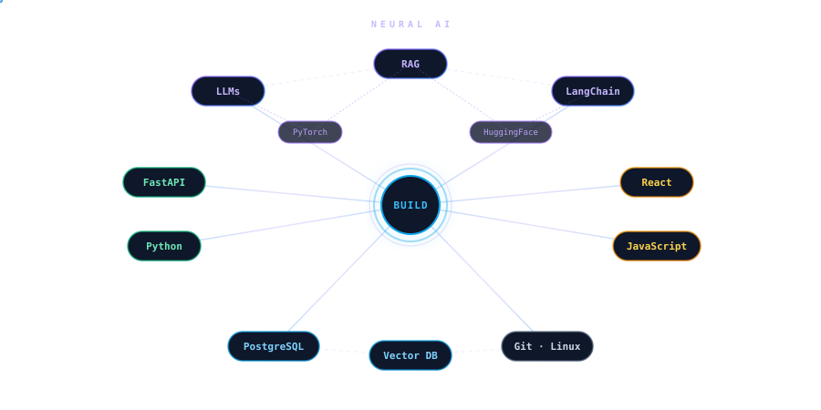

<picture>
  <source media="(prefers-color-scheme: dark)" srcset="assets/hero-dark.svg">
  <source media="(prefers-color-scheme: light)" srcset="assets/hero-light.svg">
  
</picture>

<br>

```
 4 AI products architected. 2 deployed to production. 1 startup founded. Still an undergrad.
```

I build AI-powered platforms — from multi-agent orchestration to production NLP systems — under **[InnoShay Solutions](https://innoshay.com)**, a company I founded to turn applied AI research into deployed software. Currently dual-enrolled at **IIT Madras** (BS, Computer Science) and **SRM University** (B.Tech, CS — 9.86 CGPA).

<br>


## `// FEATURED SYSTEMS`

<table>
<tr>
<td width="50%" valign="top">

### ▸ GENESIS
**Multi-Agent SDLC Automation Platform**

Architected a 5-module AI system that automates the entire software development lifecycle — from requirements analysis to architecture generation to implementation guidance.

`Python` `FastAPI` `LangChain` `LLMs` `RAG` `Vector DB`

**→** Natural language → structured engineering artifacts  
**→** Agentic AI orchestration across 5 SDLC stages  
**→** Modular FastAPI microservices with vector-search RAG

<sub>Private repository — available on request</sub>

</td>
<td width="50%" valign="top">

### ▸ HireSight
**AI Recruitment Intelligence Platform** &nbsp; [](https://hiresight.innoshay.com)

Production-deployed platform that parses resumes, extracts structured data, and performs semantic candidate-job matching using NLP and ML ranking models.

`Python` `FastAPI` `React` `NLP` `LLMs` `Scikit-Learn`

**→** Resume parsing → structured skill extraction  
**→** Cosine similarity + ML-based candidate ranking  
**→** Recruiter analytics dashboards in production

[`GitHub →`](https://github.com/InnoShay/HireSight)

</td>
</tr>
<tr>
<td width="50%" valign="top">

### ▸ Human Scriber
**Transformer-Based Content Intelligence Engine**

Fine-tuned BERT-family transformers for content analysis. Unified 4 NLP modules — tone detection, readability scoring, authenticity analysis, and writing enhancement — into a single multi-model API.

`PyTorch` `Hugging Face` `NLP` `Scikit-Learn` `FastAPI`

**→** Fine-tuned transformer models for humanization  
**→** 6-class tone classification pipeline  
**→** Multi-metric scoring across content types

[`GitHub →`](https://github.com/InnoShay/backend_humanscriber)

</td>
<td width="50%" valign="top">

### ▸ Credify
**AI Credibility & Verification Platform** &nbsp; [](https://credify.innoshay.com)

Explainable trust-scoring engine combining NLP verification pipelines, credibility indicators, and modular data validation to automate multi-source reliability assessment.

`Python` `FastAPI` `ML` `NLP` `React`

**→** Explainable per-feature trust scoring  
**→** NLP-driven multi-source verification  
**→** Scalable production deployment

[`GitHub →`](https://github.com/InnoShay/TLP)

</td>
</tr>
</table>

<br>


## `// TECHNOLOGY ECOSYSTEM`

<p align="center">
  
</p>

<details>
<summary><code>→ expand full stack</code></summary>

<br>

| Category | Technologies |
|----------|-------------|
| **Languages** | Python, JavaScript, SQL, C |
| **AI / ML** | LLMs, RAG, LangChain, NLP, PyTorch, Hugging Face Transformers, Scikit-Learn, Agentic AI, Prompt Engineering |
| **Backend** | FastAPI, REST APIs, API Design & Integration, Auth Systems |
| **Frontend** | React.js, HTML5, CSS3 |
| **Data** | PostgreSQL, MySQL, Vector Databases |
| **Infrastructure** | Git, GitHub, Linux, Cloud Deployment, Postman |
| **Core CS** | Data Structures & Algorithms, OOP, System Design, Agile |

</details>

<br>


## `// BUILDING TIMELINE`

```
2024  ──────  IIT Madras (BS, CS) + SRM University (B.Tech, CS)
              │
              ├── First projects, experiments, foundations
              │
2025  ──────  Founded InnoShay Solutions
              │
              ├── GENESIS    → Multi-agent SDLC platform
              ├── HireSight  → AI recruitment (→ production)
              ├── Credify     → AI credibility scoring (→ production)
              ├── Human Scriber → Transformer NLP engine
              │
              ├── Tech Head → Community Leader (30+ devs)
              │
2026  ──────  IBM Technovate Winner · Innowave Startup Winner
              │
              ├── IncodeVision — AI Engineering Intern
              ├── GSSOC'26 Student Ambassador
              ├── 10+ hackathons (AI, Cybersecurity, Entrepreneurship)
              │
     NOW ───  4 products shipped. 2 in production. Building next.
```

<br>


## `// ACTIVITY`

<p align="center">
  
</p>

<br>


## `// CONNECT`

<p align="center">

[`innoshay.com`](https://innoshay.com) &nbsp;&nbsp;·&nbsp;&nbsp; [`luckyjournals@gmail.com`](mailto:luckyjournals@gmail.com) &nbsp;&nbsp;·&nbsp;&nbsp; [`GitHub`](https://github.com/InnoShay)

</p>

<br>

<p align="center">
  <sub><code>LAKSHAY SHARMA // SYSTEMS ARCHITECT // 2026</code></sub>
</p>
