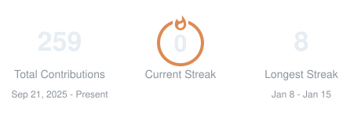
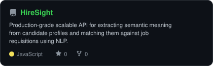
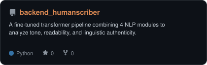
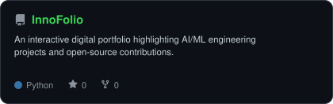
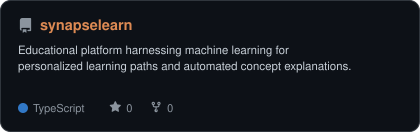

<div align="center">

<!-- PORTRAIT -->


<br>

<!-- NAME / TAGLINE -->
<a href="https://github.com/InnoShay">
  
</a>

<br>

<!-- SOCIALS -->
<a href="https://www.linkedin.com/in/innoshay/"></a>
<a href="mailto:luckyjournals@gmail.com"></a>
<a href="https://www.instagram.com/lakshay.sharma___/"></a>
<a href="https://www.instagram.com/innoshaysolutions/"></a>
<a href="https://innoshay.com/"></a>


</div>

---

## `~/` whoami

```console
$ cat about.txt
```

Hi, I'm **Lakshay Sharma**. I build intelligent systems that bridge the gap between applied AI research and usable software. My work focuses heavily on agentic AI pipelines and scalable architectures.

- Currently scaling **InnoShay** and building next-gen agentic systems
- **Leader @ Appirates**, driving developer communities and open-source ecosystems
- Studying **Computer Science** at **IIT Madras**
- Always exploring new architectures for LLM-driven applications
- Fun fact: **I started coding to automate the boring parts of my life, now I automate software lifecycles.**

<br>

<div align="center">

## `~/` toolbox

<br>

<table align="center" style="border: none; background: transparent;">
  <tr style="border: none; background: transparent;">
    <td align="right" valign="middle" style="border: none; background: transparent;"><b>Languages —</b></td>
    <td align="left" valign="middle" style="border: none; background: transparent;">
      
    </td>
  </tr>
  <tr style="border: none; background: transparent;">
    <td align="right" valign="middle" style="border: none; background: transparent;"><b>AI & ML —</b></td>
    <td align="left" valign="middle" style="border: none; background: transparent;">
      
    </td>
  </tr>
  <tr style="border: none; background: transparent;">
    <td align="right" valign="middle" style="border: none; background: transparent;"><b>Backend & Cloud —</b></td>
    <td align="left" valign="middle" style="border: none; background: transparent;">
      
    </td>
  </tr>
  <tr style="border: none; background: transparent;">
    <td align="right" valign="middle" style="border: none; background: transparent;"><b>Tools & OS —</b></td>
    <td align="left" valign="middle" style="border: none; background: transparent;">
      
    </td>
  </tr>
</table>

</div>

---

<div align="center">

## `~/` skill radar

<table>
<tr>
<td width="50%" align="center" valign="middle">

<!-- Self-rated radar -->
<picture>
  <source media="(prefers-color-scheme: dark)"  srcset="assets/radar-dark.svg">
  <source media="(prefers-color-scheme: light)" srcset="assets/radar-light.svg">
  
</picture>

</td>
<td width="50%" align="center" valign="middle">

<!-- Live radar built from real language byte counts -->
<picture>
  <source media="(prefers-color-scheme: dark)"  srcset="assets/radar-langs-dark.svg">
  <source media="(prefers-color-scheme: light)" srcset="assets/radar-langs-light.svg">
  
</picture>

</td>
</tr>
</table>

</div>

---

<div align="center">

## `~/` contribution calendar

<!-- 3D isometric calendar -->


<br><br>

<!-- Snake -->
<picture>
  <source media="(prefers-color-scheme: dark)"  srcset="https://raw.githubusercontent.com/InnoShay/InnoShay/output/snake-dark.svg">
  <source media="(prefers-color-scheme: light)" srcset="https://raw.githubusercontent.com/InnoShay/InnoShay/output/snake.svg">
  
</picture>

</div>

---

<div align="center">

## `~/` the numbers

<!-- Stat cards -->
<picture>
  <source media="(prefers-color-scheme: dark)"  srcset="assets/card-stats-dark.svg">
  <source media="(prefers-color-scheme: light)" srcset="assets/card-stats-light.svg">
  
</picture>

<br>


<br><br>


</div>

---

<div align="center">

## `~/` selected work

<!-- Project Cards -->
<table>
<tr>
<td width="50%">
  <a href="https://github.com/InnoShay/HireSight">
    <picture>
      <source media="(prefers-color-scheme: dark)"  srcset="assets/card-HireSight-dark.svg">
      <source media="(prefers-color-scheme: light)" srcset="assets/card-HireSight-light.svg">
      
    </picture>
  </a>
</td>
<td width="50%">
  <a href="https://github.com/InnoShay/backend_humanscriber">
    <picture>
      <source media="(prefers-color-scheme: dark)"  srcset="assets/card-backend_humanscriber-dark.svg">
      <source media="(prefers-color-scheme: light)" srcset="assets/card-backend_humanscriber-light.svg">
      
    </picture>
  </a>
</td>
</tr>
<tr>
<td width="50%">
  <a href="https://github.com/InnoShay/InnoFolio">
    <picture>
      <source media="(prefers-color-scheme: dark)"  srcset="assets/card-InnoFolio-dark.svg">
      <source media="(prefers-color-scheme: light)" srcset="assets/card-InnoFolio-light.svg">
      
    </picture>
  </a>
</td>
<td width="50%">
  <a href="https://github.com/InnoShay/synapselearn">
    <picture>
      <source media="(prefers-color-scheme: dark)"  srcset="assets/card-synapselearn-dark.svg">
      <source media="(prefers-color-scheme: light)" srcset="assets/card-synapselearn-light.svg">
      
    </picture>
  </a>
</td>
</tr>
</table>

</div>

---

<div align="center">

<sub>`01110100 01101000 01100001 01101110 01101011 01110011 00100000 01100110 01101111 01110010 00100000 01110011 01100011 01110010 01101111 01101100 01101100 01101001 01101110 01100111`</sub>

</div>
