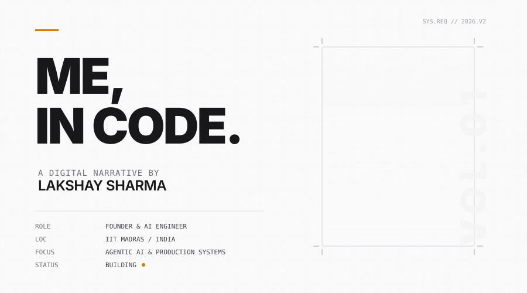
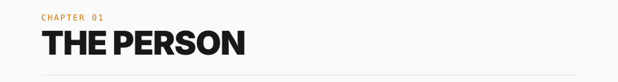
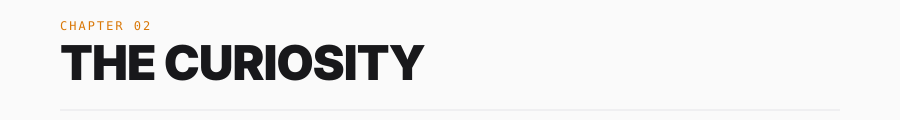
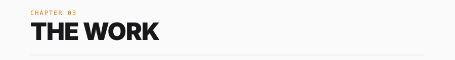
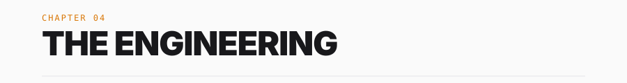
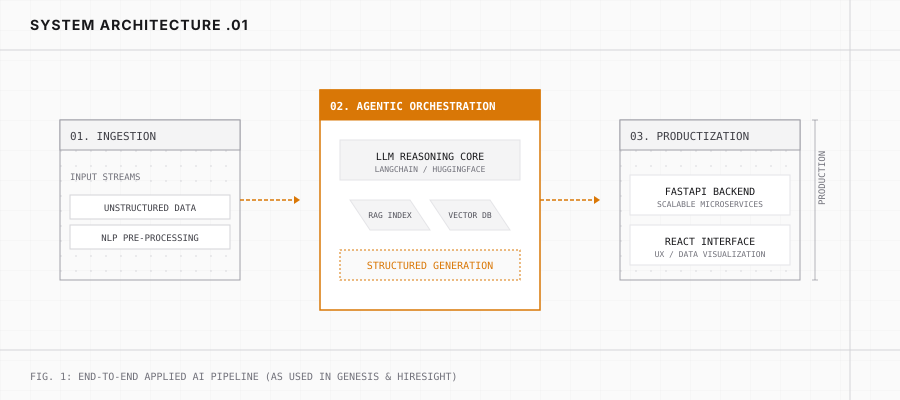
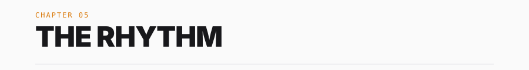
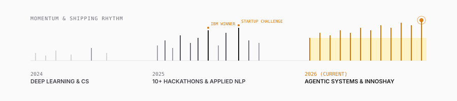

  <picture>
    <source media="(prefers-color-scheme: dark)" srcset="assets/cover-dark.svg">
    
  </picture>

  

  <picture>
    <source media="(prefers-color-scheme: dark)" srcset="assets/ch-01-dark.svg">
    
  </picture>

I am Lakshay, a builder studying Computer Science simultaneously at **IIT Madras** and **SRM University**.

But degrees are just metadata. 

In reality, I spend my time trying to figure out how to bridge the gap between applied AI research and actual, usable software. I founded **InnoShay Solutions** to create a vehicle for that exact purpose: turning complex language models into products that solve real problems.

  

  <picture>
    <source media="(prefers-color-scheme: dark)" srcset="assets/ch-02-dark.svg">
    
  </picture>

My curiosity usually pulls me toward **Agentic AI** and **Language Models**. 

I am fascinated by systems that can reason, plan, and execute. Not just chatbots, but autonomous pipelines that can handle multi-step workflows.

> "What happens when we stop using AI to just generate text, and start using it to orchestrate entire software lifecycles?"

This question is the foundation of almost everything I've built over the last two years.

  

  <picture>
    <source media="(prefers-color-scheme: dark)" srcset="assets/ch-03-dark.svg">
    
  </picture>

I learn by building. Here are the systems that define my current engineering capabilities.

### `01` GENESIS: The SDLC Automation Platform
I noticed that a massive amount of engineering time is spent on planning, requirement analysis, and documentation. I wondered if agents could handle the boilerplate of software architecture.
I architected GENESIS — a multi-agent platform using 5 specialized LLM workflows (via LangChain). It takes a natural language idea and outputs structured architecture blueprints, full technical documentation, and implementation guidance. It uses vector-search RAG to maintain context across the software lifecycle.

### `02` HireSight: AI Recruitment Intelligence
Unstructured resumes are a data extraction nightmare. I built a parsing pipeline that extracts semantic meaning from candidate profiles, then implemented NLP-based cosine similarity scoring to match them against job requisitions. It is currently deployed in production as a scalable FastAPI backend that handles concurrent evaluation workloads.

### `03` Credify: AI Credibility & Verification
Trust on the internet is deteriorating. I designed an explainable trust-scoring engine that combines NLP verification pipelines and modular data validation to assess information reliability. The core challenge wasn't just scoring, but *explainability* — surfacing why the model made a specific credibility decision.

### `04` Human Scriber: Content Intelligence
I fine-tuned BERT-family transformer models to analyze the tone, readability, and linguistic authenticity of content. It integrates 4 distinct NLP modules into a single unified API, replacing arbitrary human judgement with a 6-class deterministic scoring pipeline.

  

  <picture>
    <source media="(prefers-color-scheme: dark)" srcset="assets/ch-04-dark.svg">
    
  </picture>

Building these products forced me to develop a specific, repeatable engineering architecture. I avoid hype-driven stacks and stick to what can actually scale in production.

  <picture>
    <source media="(prefers-color-scheme: dark)" srcset="assets/engineering-blueprint-dark.svg">
    
  </picture>

 

* **The Engine:** `Python`, `LangChain`, `PyTorch`, `HuggingFace`
* **The Architecture:** `FastAPI` (Microservices), `PostgreSQL`, `Vector Databases`
* **The Interface:** `React`, `JavaScript`

  

  <picture>
    <source media="(prefers-color-scheme: dark)" srcset="assets/ch-05-dark.svg">
    
  </picture>

Somewhere along the way, building stopped being occasional and became a rhythm. 

  <picture>
    <source media="(prefers-color-scheme: dark)" srcset="assets/building-rhythm-dark.svg">
    
  </picture>

 

That momentum translated into winning the **IBM Technovate (2026)** and the **Innowave Startup Challenge**, leading a community of 30+ developers at Appirates, and contributing to massive open-source ecosystems (GSSOC & SWOC).

   

### `06` THE DOOR
I am currently scaling InnoShay and building the next iteration of agentic systems. If you are working on something technically difficult, or just want to talk about applied ML, let's connect.

[**LinkedIn**](https://linkedin.com/in/lakshay-sharma-6a01492b4/)  ·  [**innoshay.com**](https://innoshay.com)  ·  `luckyjournals@gmail.com`

 

  This profile was designed as a visual narrative. No generic templates were used.

